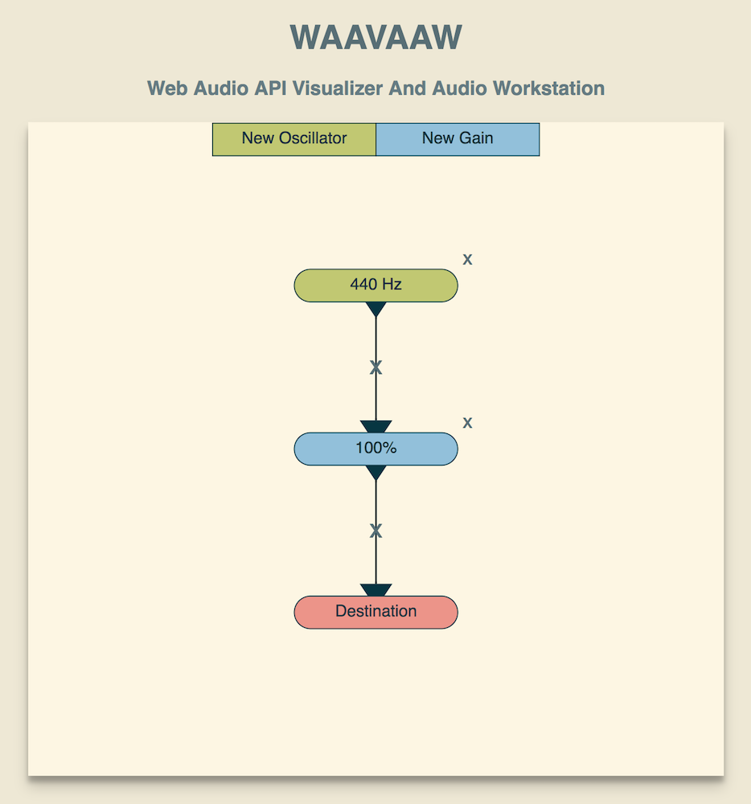

# WAAVAAW

> Web Audio API Visualizer And Audio Workstation

This is an experiment in recreating Pure Data from scratch
using [the Web Audio API](https://developer.mozilla.org/en-US/docs/Web/API/Web_Audio_API)
and [Vue.js](https://vuejs.org/).

I have no idea how far I'll get before I give up on it -
hopefully you'll be able to generate fun waveforms!

  

